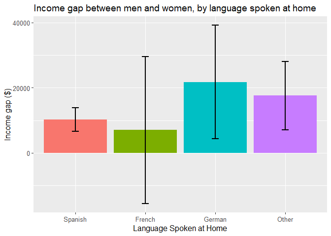
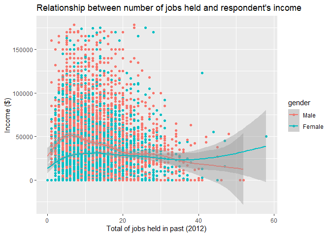

Final R Project - Gender Wage Gap
================
Hui-Chen Betty Liu
December 6, 2019

### Problem Statement

> Is there a significant difference in income between men and women?
> Does the difference vary depending on other factors (e.g., education,
> marital status, criminal history, drug use, childhood household
> factors, profession, etc.)?

### **(0)** Data cleaning and data exploration

The original nlsy dataset used for this project has 12686 observations
and 67 variables. The cleaned data set has 7024 obversations and 68
variables. This data cleaning process involved recoding all variables,
adding new variables as well as those that are not meaningful in this
context.

First, the observations that have missing values in the outcome variable
(2012 income) are filtered out because the analyses require we have
non-null values for the outcome variable. This reduced the number of
observations to 7024.

All variables were renamed so that they are descriptive. For example,
the variable representing gender was originally `R0214800` and is
renamed `gender`.

Many of the variables have negative values recorded, which represent
different non-responses. For exmple, -5 represents “Non-interview”.
Rather than including these values as a negative numeric values, these
non-responses were recoded as NA. Most variables have just negative
numbers recoded as NA, while some have additional values coded as NA
because I have decided they can be treated as NA in this context. An
example is “not currently in the workforce” for the question about
occupation. Sometimes, non-response are recoded because they are
meaningful. An example is the use of cocaine. A respondent who refuses
to report their drug use or says “I don’t know” is different from the
non-reponses representing respondents who were not given the question.

Numerical variables that have values representing qualitative responses
were recoded as categorical variables. The values were reordered in a
way that makes sense in this context. For example, for levels of
education, the values are re-ordered from lowest to highest level of
education. For a few variables, such as education and religion, new
variables were created that have binned values such as “completed high
school” and “Christian” (collapsing different Christian denominations).
Two of the family values survey questions were recoded to reflect a
general “misogynist scale”. The higher the ratings, the more likely that
the respondent is misogynist and reflects attitudes that widen the
difference betwen men and women.

Very few (only 5) variables were dropped. These variables, such as
`version`, were dropped from the cleaned dataset because they are not
meaningful in this context and are not used in the analysis to answer
the research question. The reason for dropping each variable is included
below:

  - `version` was dropped because it’s the same (445) for every
    respondent.
  - `age14.south` was dropped because the interpretation is unclear.
    It’s unclear if “Yes” means reside in the south at age 14 or not.
  - `income2012x` was dropped because the information is already
    captured by `income2012` and because it only has 64 observations.
  - `income2012y` was dropped because the information is already
    captured by `income2012` and because it only has 64 observations.
  - `spouse.income2012r` was dropped because the information is already
    captured by `spouse.income2012` and because it only has 54
    observations.

A couple new variables were created. `age.spouse` was created to capture
information about the spouse’s age using values from
`partner.birthyear`. The variable `income.topcoded` was created to label
the top 2% income earners whose values in the outcome variable were
recorded as $343,830, which is the average income of the top 2% income
earners in the data set. This variable is then used to create a filtered
data set that most of the analyses are based on. Throughout the
analyses, I will check to see if the inclusion of the topcoded values
change the conclusions of the analyses. For reference, the data frames
`nlsydata4` and `nlsydata3` are identical except for this difference.
`nlsydata4` filters out the topcoded income earners (which contains 143
respondents, with a high proportion of men). `nlsydata3` contains the
topcoded respondents.

### **(1)** Data Summary

After initial data exploration, I decided to categorize the variables
into the following groups:

  - Childhood Upbringing:
      - `us.born`
      - `usborn.south`
      - `multilingual`
      - `language`
      - `age14.urban`
      - `christian`
      - `religion`
      - `police.frisk`
      - `age.1stfrisk` (numeric)
  - Geographical:
      - `us.region`
      - `urban.residence`
  - Ethnicity and Social Status:
      - `race`
      - `poverty1979`
      - `poverty1990`
      - `poverty2000`
  - Marriage and Family Planning:
      - `marital.status1979`
      - `familysize1979` (numeric)
      - `nonbio.children` (numeric)
      - `age.nonbiokid` (numeric)
      - `number.children` (numeric)
      - `familysize2000` (numeric)
      - `household.income1999` (numeric)
      - `maritalc.status2000`
      - `marital.status2000`
      - `months.marryto1stkid`
      - `familysize2012` (numeric)
  - Spouse:
      - `spouse.occupation2000`
      - `spouse.workhours2000` (numeric)
      - `partner.birthyear`
      - `spouse.occupation2012`
      - `spouse.workhours2012` (numeric)
      - `spouse.income2012` (numeric)
      - `age.spouse` (numeric)
  - Education:
      - `education1979`
      - `education1990`
      - `education2012`
      - `exp.edu1979`
      - `edu.completedin1990`
      - `edu.completedin2012`
  - Work Experience, Ambitions, Income:
      - `veteran`
      - `ideal.occupation`
      - `schoolin5years`
      - `income1990` (numeric)
      - `jobsheld.1990` (numeric)
      - `industry2000`
      - `occupation2000`
      - `income2000` (numeric)
      - `industry2012`
      - `occupation2012`
      - `jobs.held2012` (numeric)
  - Values:
      - `fa.womenathome`
      - `fa.notimetowork`
      - `fa.proworkwife`
      - `fa.badchildren`
      - `fa.genderrole`
      - `fa.menhousework`
      - `fa.happytradrole`
  - Criminal History and Substance Use:
      - `crime.charge`
      - `age.1stalcohol` (numeric)
      - `marijuana`
      - `age.1stmarijuana` (numeric)
      - `cocaine1990`
      - `age.1stcocaine` (numeric)
      - `alcohol.dailyconsume` (numeric)

`gender`, `income2012`, and `income.topcoded` are not in any of the
categories above.

The assumption is that the variables within each group are similar to
each other and have high covariate because they are getting at the same
information. That is, the variables in the Childhood Upbringing category
might help describe the affect of the respondent’s childhood on his/her
future income. Every variable is presented in a way to see if men and
women are treated differently, and if that difference has an effect of
their income. This helps us see if the income gap between men and women
is correlated with a specific aspect of their life experiences.

In this section, I will compare the variables within each group to see
which best explains the difference in income between men and women. In
the next section, I will choose a subset of these variables for a linear
regression analysis.

**(a)** Childhood Uprbringing

    ## # A tibble: 2 x 5
    ##   us.born income.gap  upper  lower is.significant
    ##   <fct>        <dbl>  <dbl>  <dbl>          <dbl>
    ## 1 US          13086. 11379. 14793.              1
    ## 2 Non-US      16410.  9729. 23092.              1

<!-- -->

    ## # A tibble: 2 x 5
    ##   usborn.south income.gap  upper  lower is.significant
    ##   <fct>             <dbl>  <dbl>  <dbl>          <dbl>
    ## 1 Non-South        15912. 13583. 18240.              1
    ## 2 South             9113.  6640. 11585.              1

<!-- -->

    ## # A tibble: 2 x 5
    ##   multilingual income.gap  upper  lower is.significant
    ##   <fct>             <dbl>  <dbl>  <dbl>          <dbl>
    ## 1 English          13965. 12052. 15878.              1
    ## 2 Multilingual     11287.  7999. 14575.              1

<!-- -->

    ## # A tibble: 4 x 5
    ##   language income.gap   upper  lower is.significant
    ##   <fct>         <dbl>   <dbl>  <dbl>          <dbl>
    ## 1 Spanish      10178.   6557. 13798.              1
    ## 2 French        7036. -15523. 29596.              0
    ## 3 German       21763.   4369. 39157.              1
    ## 4 Other        17565.   7134. 27996.              1

<!-- -->

    ## # A tibble: 3 x 5
    ##   age14.urban income.gap  upper  lower is.significant
    ##   <fct>            <dbl>  <dbl>  <dbl>          <dbl>
    ## 1 City            13245. 11340. 15150.              1
    ## 2 Country         15127. 11300. 18955.              1
    ## 3 Farm            10599.  3800. 17397.              1

<!-- -->

    ## # A tibble: 10 x 5
    ##    religion       income.gap  upper  lower is.significant
    ##    <fct>               <dbl>  <dbl>  <dbl>          <dbl>
    ##  1 No religion          847. -6687.  8380.              0
    ##  2 Protestant         16305.  8831. 23780.              1
    ##  3 Baptist             7451.  4769. 10133.              1
    ##  4 Episcopalian       14673.  -154. 29500.              0
    ##  5 Lutheran           13397.  5469. 21324.              1
    ##  6 Methodist          18026. 11596. 24455.              1
    ##  7 Presbyterian       20849.  8853. 32845.              1
    ##  8 Roman Catholic     17108. 14204. 20012.              1
    ##  9 Jewish             41127. 16183. 66071.              1
    ## 10 Other              16364. 11000. 21728.              1

<!-- -->

    ## # A tibble: 3 x 5
    ##   christian      income.gap  upper  lower is.significant
    ##   <fct>               <dbl>  <dbl>  <dbl>          <dbl>
    ## 1 Not Christian      12486.  8082. 16889.              1
    ## 2 Christian          11164.  8911. 13418.              1
    ## 3 Roman Catholic     17108. 14204. 20012.              1

<!-- -->

    ## # A tibble: 2 x 5
    ##   police.frisk income.gap  upper  lower is.significant
    ##   <fct>             <dbl>  <dbl>  <dbl>          <dbl>
    ## 1 Not Frisked      14785. 12854. 16716.              1
    ## 2 Frisked          10797.  6388. 15207.              1

<!-- -->

<!-- -->

**(b)** Geographical

    ## # A tibble: 4 x 5
    ##   us.region     income.gap  upper  lower is.significant
    ##   <fct>              <dbl>  <dbl>  <dbl>          <dbl>
    ## 1 South             11850.  9325. 14374.              1
    ## 2 Northeast         13082.  8561. 17604.              1
    ## 3 North Central     14838. 11490. 18186.              1
    ## 4 West              14181. 10383. 17979.              1

<!-- -->

    ## # A tibble: 3 x 5
    ##   urban.residence income.gap  upper  lower is.significant
    ##   <fct>                <dbl>  <dbl>  <dbl>          <dbl>
    ## 1 Urban               13107. 11193. 15022.              1
    ## 2 Rural               14031. 10597. 17465.              1
    ## 3 Unknown             11494.   180. 22808.              1

<!-- -->

**(c)** Ethnicity and social status

    ## # A tibble: 3 x 5
    ##   race     income.gap  upper  lower is.significant
    ##   <fct>         <dbl>  <dbl>  <dbl>          <dbl>
    ## 1 Other        19559. 17066. 22052.              1
    ## 2 Hispanic     11125.  7596. 14654.              1
    ## 3 Black         5403.  2842.  7963.              1

<!-- -->

    ## # A tibble: 2 x 5
    ##   poverty1979    income.gap  upper  lower is.significant
    ##   <fct>               <dbl>  <dbl>  <dbl>          <dbl>
    ## 1 Not in Poverty     14897. 12736. 17059.              1
    ## 2 Poverty             7284.  4170. 10397.              1

<!-- -->

    ## # A tibble: 2 x 5
    ##   poverty1990    income.gap  upper  lower is.significant
    ##   <fct>               <dbl>  <dbl>  <dbl>          <dbl>
    ## 1 Not in Poverty     15226. 13192. 17261.              1
    ## 2 Poverty             4041.   712.  7370.              1

<!-- -->

    ## # A tibble: 2 x 5
    ##   poverty2000    income.gap  upper  lower is.significant
    ##   <fct>               <dbl>  <dbl>  <dbl>          <dbl>
    ## 1 Not in Poverty     15089. 13010. 17169.              1
    ## 2 Poverty             1253. -1355.  3862.              0

<!-- -->

**(d)** Marriage and Family
Planning

<!-- -->
Most respondents were too young to be married in 1979. There were not
enough data points in categories other than never married to get a
meaningful data visualization of the income gap. The same problem
applies to family size in 1979, in 2000 and 2012. There are not enough
data at each level to see the difference in income between men and
women, even when we treat family size and number of children as
categorical
variables.

<!-- -->

There are not enough observations to put a smooth line on adopted and
step children graph.
<!-- -->

<!-- -->

<!-- -->

<!-- -->

    ## # A tibble: 5 x 5
    ##   marital.status2000 income.gap   upper  lower is.significant
    ##   <fct>                   <dbl>   <dbl>  <dbl>          <dbl>
    ## 1 Never Married          -1823.  -5315.  1669.              0
    ## 2 Married                23195.  20904. 25485.              1
    ## 3 Separated               8360.   2055. 14664.              1
    ## 4 Divorced                4538.    354.  8723.              1
    ## 5 Widowed                 7650. -10473. 25772.              0

<!-- -->

    ## # A tibble: 3 x 5
    ##   maritalc.status2000     income.gap  upper  lower is.significant
    ##   <fct>                        <dbl>  <dbl>  <dbl>          <dbl>
    ## 1 Never Married               -1823. -5315.  1669.              0
    ## 2 Married, Spouse Present     23713. 21383. 26043.              1
    ## 3 Other                        6248.  2963.  9533.              1

<!-- -->

    ## # A tibble: 15 x 5
    ##    months.marryto1stkid income.gap    upper  lower is.significant
    ##    <fct>                     <dbl>    <dbl>  <dbl>          <dbl>
    ##  1 Same month                3074. -10732.  16879.              0
    ##  2 Within a year            17200.  13662.  20738.              1
    ##  3 2 years                  21370.  16739.  26001.              1
    ##  4 3 years                  22786.  17077.  28496.              1
    ##  5 4 years                  17770.  10738.  24802.              1
    ##  6 5 years                  20059.  11913.  28206.              1
    ##  7 6 years                  19412.  10322.  28502.              1
    ##  8 7 years                  23433.  12475.  34392.              1
    ##  9 8 years                  19099.   8792.  29406.              1
    ## 10 9 years                  20142.   7636.  32647.              1
    ## 11 11 years                 35206.  20102.  50310.              1
    ## 12 12 years                 16335.    -75.9 32746.              0
    ## 13 More than 12 years       12194.   4545.  19843.              1
    ## 14 Never married            -2208.  -6189.   1773.              0
    ## 15 No children               -601.  -4508.   3306.              0

<!-- -->

<!-- -->

**(e)**
Spouse

<!-- -->

<!-- -->

<!-- -->

<!-- -->

<!-- -->

<!-- -->

**(f)**
Education

<!-- -->

<!-- -->

<!-- -->

<!-- -->

<!-- -->

<!-- -->

**(g)** Work Experience, Ambitions, Income

    ## # A tibble: 2 x 5
    ##   veteran     income.gap  upper  lower is.significant
    ##   <fct>            <dbl>  <dbl>  <dbl>          <dbl>
    ## 1 Not veteran     13789. 11603. 15975.              1
    ## 2 Veteran         17847.  5861. 29833.              1

<!-- -->

<!-- -->

    ## # A tibble: 2 x 5
    ##   schoolin5years income.gap  upper  lower is.significant
    ##   <fct>               <dbl>  <dbl>  <dbl>          <dbl>
    ## 1 No                 13128. 11068. 15189.              1
    ## 2 Yes                14070. 11216. 16923.              1

<!-- -->

<!-- -->

<!-- -->

<!-- -->

<!-- -->

<!-- -->

<!-- -->

<!-- -->

**(h)** Values

    ## # A tibble: 4 x 5
    ##   fa.womenathome income.gap  upper  lower is.significant
    ##            <dbl>      <dbl>  <dbl>  <dbl>          <dbl>
    ## 1              1     13871.  9807. 17936.              1
    ## 2              2     16569. 14220. 18917.              1
    ## 3              3     17950. 14346. 21553.              1
    ## 4              4     12967.  7783. 18150.              1

<!-- -->

    ## # A tibble: 4 x 5
    ##   fa.notimetowork income.gap  upper  lower is.significant
    ##             <dbl>      <dbl>  <dbl>  <dbl>          <dbl>
    ## 1               1     12248.  5996. 18500.              1
    ## 2               2     15258. 13010. 17507.              1
    ## 3               3     15169. 12149. 18188.              1
    ## 4               4     15742. 10339. 21145.              1

<!-- -->

    ## # A tibble: 4 x 5
    ##   fa.proworkwife income.gap  upper  lower is.significant
    ##   <fct>               <dbl>  <dbl>  <dbl>          <dbl>
    ## 1 1                  11027.  6615. 15439.              1
    ## 2 2                  15349. 13094. 17605.              1
    ## 3 3                  11347.  8151. 14543.              1
    ## 4 4                  11425.  2314. 20535.              1

<!-- -->

    ## # A tibble: 4 x 5
    ##   fa.badchildren income.gap  upper  lower is.significant
    ##            <dbl>      <dbl>  <dbl>  <dbl>          <dbl>
    ## 1              1     12485.  8009. 16960.              1
    ## 2              2     12324. 10066. 14583.              1
    ## 3              3     18881. 15542. 22219.              1
    ## 4              4     16268. 10024. 22511.              1

<!-- -->

    ## # A tibble: 4 x 5
    ##   fa.genderrole income.gap  upper  lower is.significant
    ##           <dbl>      <dbl>  <dbl>  <dbl>          <dbl>
    ## 1             1     10526.  4236. 16817.              1
    ## 2             2     15843. 13211. 18475.              1
    ## 3             3     16003. 13365. 18640.              1
    ## 4             4     11726.  7555. 15896.              1

<!-- -->

    ## # A tibble: 4 x 5
    ##   fa.menhousework income.gap  upper  lower is.significant
    ##   <fct>                <dbl>  <dbl>  <dbl>          <dbl>
    ## 1 1                   12157.  8446. 15867.              1
    ## 2 2                   14829. 12584. 17074.              1
    ## 3 3                   14225. 10281. 18169.              1
    ## 4 4                   14275.  7060. 21491.              1

<!-- -->

    ## # A tibble: 4 x 5
    ##   fa.happytradrole income.gap  upper  lower is.significant
    ##              <dbl>      <dbl>  <dbl>  <dbl>          <dbl>
    ## 1                1     13987.  7999. 19975.              1
    ## 2                2     16463. 14081. 18846.              1
    ## 3                3     12719.  9975. 15463.              1
    ## 4                4      9623.  4399. 14848.              1

<!-- -->

**(i)** Criminal History and Substance Use

    ## # A tibble: 2 x 5
    ##   crime.charge  income.gap  upper  lower is.significant
    ##   <fct>              <dbl>  <dbl>  <dbl>          <dbl>
    ## 1 Never charged     15269. 13465. 17073.              1
    ## 2 Charged            6865.   905. 12826.              1

<!-- -->

<!-- -->

    ## # A tibble: 6 x 5
    ##   marijuana income.gap  upper  lower is.significant
    ##       <dbl>      <dbl>  <dbl>  <dbl>          <dbl>
    ## 1         0     15830. 13086. 18573.              1
    ## 2         1     13298.  9998. 16598.              1
    ## 3         2     13023.  7477. 18568.              1
    ## 4         3     10704.  4430. 16977.              1
    ## 5         4     16339. 10741. 21936.              1
    ## 6         5      5852.  -903. 12607.              0

<!-- -->

<!-- -->

    ## # A tibble: 9 x 5
    ##   cocaine1990       income.gap   upper  lower is.significant
    ##   <fct>                  <dbl>   <dbl>  <dbl>          <dbl>
    ## 1 Never                 15861.  13867. 17855.              1
    ## 2 1-2 times              8883.   1848. 15917.              1
    ## 3 3-5 times             17868.   9159. 26577.              1
    ## 4 6-10 times             6161.  -4195. 16518.              0
    ## 5 11-49 times           16672.   8798. 24545.              1
    ## 6 50-99 times            4190.  -8639. 17019.              0
    ## 7 100 or more times      4964.  -3475. 13404.              0
    ## 8 Refuse to answer       8883. -11976. 29741.              0
    ## 9 I don't know         -33333. -91497. 24830.              0

<!-- -->

<!-- -->

<!-- -->

### **(2)** Methodology

Initially, I had planned on choosing a variable from each of the
categories above to represent an aspect of the respondent’s life
experience that may contribute to their future income. However, after
looking at the data, I decided that some of these variables are not
candidates for the regression analysis because (1) the data suggests the
are not related to the outcome variable (respondent’s income in 2012)
and (2) they do seem to contribute to a difference in income between men
and women that have the same characteristics. The following 7 variables
were chosen for the regression analsyis:

  - race (`race`)
  - childhood poverty (`poverty1990`)
  - recent marital status (`maritalc.status2000`)
  - early career income (`income1990`)
  - spouse’s work (`spouse.workhours2012`)
  - education level (`edu.completedin2012`)

The missing values were coded as NA and were left out of the analysis.
This led to sometimes having too few data points, or an highly unequal
proportion of men or women to have meaningful analyse of the data using
t-tests. Since we are limiting ourselves to respondents who have
recorded values for their 2012 income, many were too young to have
participated in the survey in 1979. Therefore, there were more missing
values from the earlier survey questions. This led me to select
variables from more recent years (1990 onwards), which have fewer
missing values.

To address the problem with the top-coded values, I created two
identical data sets that are different only in their inclusion/exclusion
of the top-coded 143 respondents. My approach is to first do the
exploratory analyses of each variable’s relationship to the 2012 income
outcome variable without the top-coded incomes (which are outliers since
they are the top 2% and part of the long right tail), and then test the
regression model with both data sets to check for differences in fit.

There were table plots that I created which I thought would reveal
interesting trends but dit not. The most notable was the data on number
of children. Plotting the number of children in 2000 against income 2012
revealed a strong negative relationship. The trend shows that an
increase in number of children leads to decrease in income. This would
have been interesting if men were asked the same question. Due to the
survey design, only women were asked about the number of biological
children they have. Even though men have biological children too, they
were not asked this question. This is a flaw in the survey design. The
lack of data from male respondents meant I could not do an analysis of
the difference in income between men and women who have the same number
of children, to see if that contributes to an the income gap.

There were several relationships I investigated that do not appear in my
findings section. One example is the relationship between religion and
income. The variable `christian` which shows a statistically significant
difference in the gender income gaps between Christians and Roman
Catholics. The data suggested that men and women who are Roman Catholic
experience a larger difference in income than Christians. This analysis
was not used because it’s from the earlier survey version in 1979. I did
not feel confident to assume that people’s religious believes from their
childhood have strong effects on their future income, as people do
change their religious beliefs over time.

### **(3)** Findings

The variables `gender`, `race`, `poverty level in 2000`, `income
in 1990`, `marital status in 2000`, and `number of hours spouse worked
in 2012` were used to regressed against
income.

|                                            |    Estimate | Std. Error |  t value | Pr(\>|t|) |
| :----------------------------------------- | ----------: | ---------: | -------: | --------: |
| (Intercept)                                |   34560.318 |   4110.058 |    8.409 |    0.0000 |
| genderFemale                               | \-16904.804 |   1654.949 | \-10.215 |    0.0000 |
| raceHispanic                               |  \-8595.756 |   2467.327 |  \-3.484 |    0.0005 |
| raceBlack                                  |  \-6142.496 |   2314.938 |  \-2.653 |    0.0080 |
| poverty1990Poverty                         |  \-5671.990 |   2488.590 |  \-2.279 |    0.0227 |
| income1990                                 |       0.926 |      0.050 |   18.619 |    0.0000 |
| maritalc.status2000Married, Spouse Present |    1334.339 |   2471.590 |    0.540 |    0.5893 |
| maritalc.status2000Other                   |  \-3120.982 |   2875.230 |  \-1.085 |    0.2778 |
| spouse.workhours2012                       |      46.249 |     62.683 |    0.738 |    0.4607 |
| genderFemale:raceHispanic                  |    9127.587 |   3405.256 |    2.680 |    0.0074 |
| genderFemale:raceBlack                     |    4630.348 |   3253.349 |    1.423 |    0.1548 |

Based on the p-values shown, it looks like `gender`, `income1990` (the
respondent’s income in 1990), and `race` are statistically significant
predictors of income in 2012. Gender and race are negative coefficients.
Income in 1990 id s positive coefficient. This means being female and
being black are negatively associated with income, while having income
in 1990 is positively associated with income in 2012.

**Plot Diagnostics**

Let’s take a look at the plot diagnostics.
<!-- --><!-- --><!-- --><!-- -->

**Residuals vs Fitted**

This plot suggests non-linearity. There is a straight downward sloping
line, which is expected because there is no negative income. Variance
appears to increase with fitted values.

**Normal Q-Q**

This plot appears somewhat normal, with heavy upper tail thatn what is
expected under noramlity. This could be due to the non-constant variance
that is present in the residuals vs fitted plot above.

**Scale Location Plot** There is an increasing trend in residual
variance, which is indicated by the upward sloping red line. There is
also a clear straight line of riduals which could be due to the 1990
income variable.

**Residual vs Leverage** There are no clear outliers in the upper right
or lower right.

Check if this looks the same with top-coded
data.

|                                            |    Estimate | Std. Error |  t value | Pr(\>|t|) |
| :----------------------------------------- | ----------: | ---------: | -------: | --------: |
| (Intercept)                                |   34560.318 |   4110.058 |    8.409 |    0.0000 |
| genderFemale                               | \-16904.804 |   1654.949 | \-10.215 |    0.0000 |
| raceHispanic                               |  \-8595.756 |   2467.327 |  \-3.484 |    0.0005 |
| raceBlack                                  |  \-6142.496 |   2314.938 |  \-2.653 |    0.0080 |
| poverty1990Poverty                         |  \-5671.990 |   2488.590 |  \-2.279 |    0.0227 |
| income1990                                 |       0.926 |      0.050 |   18.619 |    0.0000 |
| maritalc.status2000Married, Spouse Present |    1334.339 |   2471.590 |    0.540 |    0.5893 |
| maritalc.status2000Other                   |  \-3120.982 |   2875.230 |  \-1.085 |    0.2778 |
| spouse.workhours2012                       |      46.249 |     62.683 |    0.738 |    0.4607 |
| genderFemale:raceHispanic                  |    9127.587 |   3405.256 |    2.680 |    0.0074 |
| genderFemale:raceBlack                     |    4630.348 |   3253.349 |    1.423 |    0.1548 |

This looks pretty similar to the output without top-coded data. The
variables `gender`, `race` and `income1990` are significant.

**Interpretations**

It does not look like linear regression is the right model for
explaining how these variables are related to income. Looking at the
coefficients that are significant:

> On average, holding other things equal, being female is associated
> with $34,560.32 decrease in annual income.

### **(4)** Discussion

This project has been fun and sobering at the same time. A difference in
income between men and women is observed even when you hold many other
factors constant. Some factors like childhood poverty, race, and one’s
early career income are associated with the widening of this gap. One
potential confounding factor is the 1990 income. I had assumed that
income from 1990 respresented early career income, though it is possible
that for those respondents who have had the same job from 1990 to 2012,
it is the same data point.

There are many limitations to this project. A log transform of the
income variable could have yielded a better fitted regression. But while
the regression analysis shows how gender (being female) is negatively
associated with income earnings, it does not explain why there is a
difference in men and women’s income.

Overall, I do not have high confidence in my analyses. Due to time
constraint, I did not have the chance to fully explore the data and try
more combinations of variables for the regression model. I do not
currently feel confident enough in my analysis to present it to policy
makers.

### **(5)** Acknowledgement

I relied heavily on Professor Alexandra Chouldechova’s lecture notes for
completing this project. In addition, I am thankful for the discussions
with Kayla Reiman, who helped me figure out several debugging issues.
